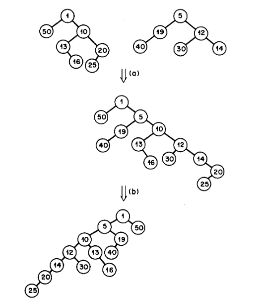

# Skew Heaps

A skew heap is a very simple implementation of a priority queue,
which is just a data structure that returns the lowest (or highest)
value stored in the structure. It is often useful for search algorithms
where you want to search starting at best possible location. Assume
for now that it is storing the lowest value.

The skew heap is implemented as a binary tree where the top node
in the tree is the minimum (or maximum value) and every node value
in the tree is greater than that of its parent. The main operation
in a skew heap is the merger of two heaps. Given two trees, `h1` and
`h2`, you compare the values at the top of each heap, and the minimum
value is the value for the top of the merged heap. Now, if `h1` is
the tree with the minimum value, let `l1` and `r1` be the left and
right children of `h1`.

The new heap has the value of `h1` at the root, and then the left
child of the new heap is the merge of `r1` and `h2`, and the right
child is `l1`.

Here is an example of a merge. This image is from the paper on [Self-Adjusting
Heaps](https://www.cs.cmu.edu/~sleator/papers/adjusting-heaps.pdf) by Sleator
and Tarjan.

To add a new item to the heap, just create a new heap with the new
value and empty left and right children, and use the merge function to
merge it with the heap.

To extract the minimum value from the heap, take the value at the
top of the heap, and then merge the left and right children to
create a new heap.

This repo is intended for us to implement a Skew Heap in various
functional languages. Just add a new directory with your name, a +,
and the implementation language (e.g. `markwutka+haskell`).
